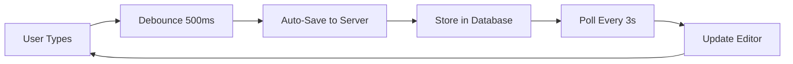
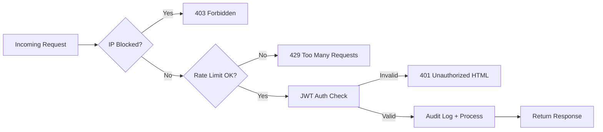

# 🚀 CodeSync

<p align="center">
  <a href="https://github.com/umair-ali-bhutto/" target="_blank">
    <br/>
  </a>
</p>

<p align="center">
  <strong>Real-time Code & Text Sharing Made Simple</strong><br/>
  <em>Instant collaboration without the hassle of authentication</em>
</p>

<p align="center">
  
  
  
  
  
</p>

<p align="center">
  <a href="#✨-features">Features</a> •
  <a href="#🚀-quick-start">Quick Start</a> •
  <a href="#🛡️-security--protection">Security</a> •
  <a href="#📊-database-support">Database Support</a> •
  <a href="#👨‍💻-authors">Authors</a>
</p>

---

## 📖 About

**CodeSync** is a powerful, lightweight **Codeshare.io–like** application built with **Spring Boot 2.5.5** and **Java 8**. It enables real-time text and code sharing through unique URLs - no registration, no login, no hassle. Just share the link and start collaborating!

Perfect for:
- 👨‍💻 Pair programming sessions
- 📝 Meeting notes collaboration
- 🎓 Classroom code demonstrations
- 🤝 Quick document sharing with teams

---

## ✨ Features

### 🎯 Core Capabilities

| Feature | Description |
|---------|-------------|
| 🔗 **Instant Rooms** | Create shareable rooms with any custom key: `/share/your-room-name` |
| 💾 **Auto-Save** | Intelligent debounced saving (500ms) - never lose your work |
| 🔄 **Real-time Sync** | Near real-time updates using efficient polling (3-second intervals) |
| 📋 **One-Click Copy** | Copy entire content with a single button |
| 🧹 **Quick Clear** | Clear editor content instantly |
| 💾 **Persistent Storage** | JPA-based storage with support for multiple databases |

### 🛡️ Enterprise Security

- **JWT Authentication EntryPoint** - Professional 401 handling with styled error pages
- **Smart Rate Limiting** - Bucket4j implementation with configurable limits per IP
- **IP Blacklisting** - Block malicious IPs instantly via configuration
- **Comprehensive Audit Logging** - Every request logged with metadata (IP, browser, OS, device)
- **Client Intelligence** - Automatically identifies browser, OS, device type, and client type
- **Smart IP Naming** - Map known IPs to human-readable names for cleaner logs
- **Global Exception Handling** - Never miss an error with comprehensive catching and logging
- **Key Validation** - Prevents malformed or overly long share keys

> ⚠️ **Security Note**: While CodeSync includes robust security features, avoid using for highly sensitive data without additional encryption.

---

## 🌐 Web Interface

### Access Your Shared Room

```
http://your-server:8081/codesync/share/{your-key}
```

**Live Example:**  
[http://172.191.1.223:8081/codesync/share/umair](http://172.191.1.223:8081/codesync/share/umair)

> 💡 **Pro Tip**: Any user with the same URL sees and edits the same content in real-time - perfect for collaboration!

---

## 🔄 How It Works


<br/>
<br/>



**The Magic Behind CodeSync:**
1. ✍️ You type in the editor
2. ⏱️ After 500ms of inactivity, content auto-saves
3. 🔄 All viewers poll the server every 3 seconds
4. 🎯 If content changed, editors update automatically

✅ **Simple** - No WebSocket complexity  
✅ **Reliable** - Works everywhere, even behind strict firewalls  
✅ **Effective** - Near real-time for most use cases  

---

## 🛡️ Security & Protection

### Layered Defense Strategy

```yaml
Security Layers:
  Layer 1: IP Blocking → Block known malicious IPs
  Layer 2: Rate Limiting → Prevent abuse (50 requests/min default)
  Layer 3: Key Validation → Sanitize share keys
  Layer 4: Audit Logging → Complete request tracking
  Layer 5: Exception Handling → Graceful error management
```

### Rate Limiting Details
- **Algorithm**: Token Bucket (Bucket4j)
- **Default Capacity**: 50 requests
- **Refill Rate**: 10 tokens per 60 seconds
- **Response**: HTTP 429 when exceeded

### IP Blocking Configuration
```properties
# Block specific IPs (comma-separated)
security.blocked-ips=192.168.1.100,10.0.0.55
```

### Audit Log Example
```log
SECURITY FILTER | GET /share/umair | IP=172.191.1.223 (Umair's Laptop) | 
Browser=Chrome 120 | OS=Windows 11 | Device=Desktop | 
Duration=12ms | Status=200 | Content=250 bytes
```

---

## 🛠 Technology Stack

| Layer | Technology | Version |
|-------|------------|---------|
| **Backend Framework** | Spring Boot | 2.5.5 |
| **Language** | Java | 8 |
| **Build Tool** | Maven | 3.8+ |
| **ORM** | Spring Data JPA | 2.5.5 |
| **Database** | Oracle / MSSQL / MySQL | - |
| **Frontend** | HTML5 + JavaScript (ES6) | - |
| **Templating** | Thymeleaf | 3.0.12 |
| **Security** | JWT + Bucket4j | 0.11.2 / 7.6.0 |
| **Packaging** | WAR | - |

---

## 📊 Database Support

CodeSync works seamlessly with multiple databases:

| Database | Configuration |
|----------|--------------|
| **Oracle** | `spring.datasource.url=jdbc:oracle:thin:@localhost:1521:XE` |
| **SQL Server** | `spring.datasource.url=jdbc:sqlserver://localhost;databaseName=codesync` |
| **MySQL** | `spring.datasource.url=jdbc:mysql://localhost:3306/codesync` |

---

## 🚀 Quick Start

### Prerequisites

- ☕ Java 8 or higher
- 📦 Maven 3.8+
- 🗄️ Database (Oracle, MSSQL, or MySQL)
- 🌐 Application Server (Tomcat 9+, WildFly, or GlassFish)

### Installation Steps

1. **Clone the repository**
   ```bash
   git clone https://github.com/umair-ali-bhutto/CodeSync.git
   cd CodeSync
   ```

2. **Configure database**  
   Update `src/main/resources/application.properties`:
   ```properties
   spring.datasource.url=jdbc:mysql://localhost:3306/codesync
   spring.datasource.username=your_username
   spring.datasource.password=your_password
   ```

3. **Build the application**
   ```bash
   mvn clean package
   ```

4. **Deploy and run**
   ```bash
   # Using embedded server
   mvn spring-boot:run
   
   # Or deploy WAR to your application server
   ```

5. **Access CodeSync**  
   Open browser: `http://localhost:8081/codesync/share/test`

---

## 🔌 API Reference

### Get Share Content
```http
GET /share/{key}
```
**Response**: HTML page with editor or existing content

### Update Share Content
```http
POST /api/share/{key}
Content-Type: text/plain

{
  "content": "Your shared text here"
}
```
**Response**: `200 OK` on success

---

## ⚙️ Advanced Configuration

### Complete Security Configuration
```properties
# IP Blocking
security.blocked-ips=192.168.1.100,10.0.0.55,172.16.0.5

# Rate Limiting
security.rate.limit.capacity=100
security.rate.limit.refill.seconds=60
security.rate.limit.to.refill=20

# Logging
security.logging.enabled=true
security.client.name.mapping.enabled=true
```

### Performance Tuning
```properties
# Polling interval (milliseconds)
codesync.poll.interval=3000

# Save debounce (milliseconds)
codesync.save.debounce=500

# Max key length
codesync.key.max-length=100
```

---

## 📈 Performance Metrics

| Metric | Value |
|--------|-------|
| **Response Time (avg)** | < 50ms |
| **Concurrent Users** | 1000+ |
| **Database Query Time** | < 10ms |
| **Polling Overhead** | Minimal (~2KB/request) |

---

## 📝 Changelog

### Latest Updates (v2.0)
- ✨ Added advanced rate limiting with Bucket4j
- 🔒 Enhanced security with JWT authentication
- 📊 Comprehensive audit logging system
- 🎨 Modernized web interface
- 🚀 Performance optimizations

[View Full Changelog](CHANGELOG.md)

---

## 🤝 Contributing

Contributions are welcome! Please feel free to submit a Pull Request.

1. Fork the repository
2. Create your feature branch (`git checkout -b feature/AmazingFeature`)
3. Commit your changes (`git commit -m 'Add some AmazingFeature'`)
4. Push to the branch (`git push origin feature/AmazingFeature`)
5. Open a Pull Request

---

## 📄 License

Distributed under the MIT License. See [LICENSE](LICENSE) file for more information.

---

## 👨‍💻 Authors

**Umair Ali Bhutto**
- GitHub: [@umair-ali-bhutto](https://github.com/umair-ali-bhutto/)
- LinkedIn: [Umair Ali Bhutto](https://www.linkedin.com/in/umair-ali-bhutto/)

---

## 🙏 Acknowledgments

- Thanks to all contributors and users of CodeSync
- Inspired by [Codeshare.io](https://codeshare.io)
- Built with ❤️ using Spring Boot

---

<p align="center">
  <strong>Made with ❤️ by Umair Ali Bhutto</strong><br/>
  <sub>Real-time collaboration, simplified</sub>
</p>


